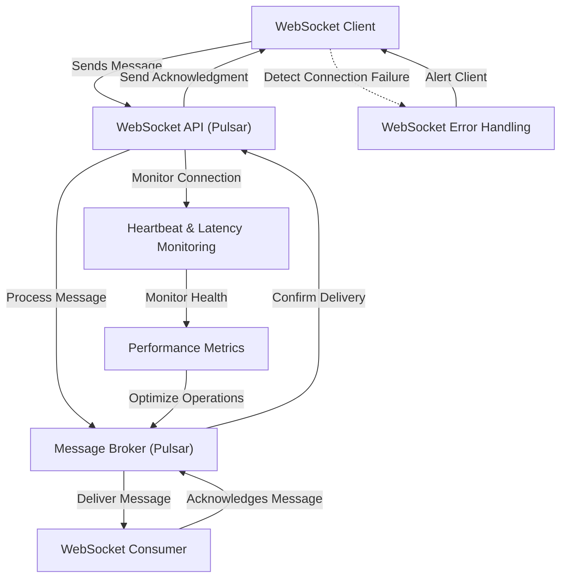
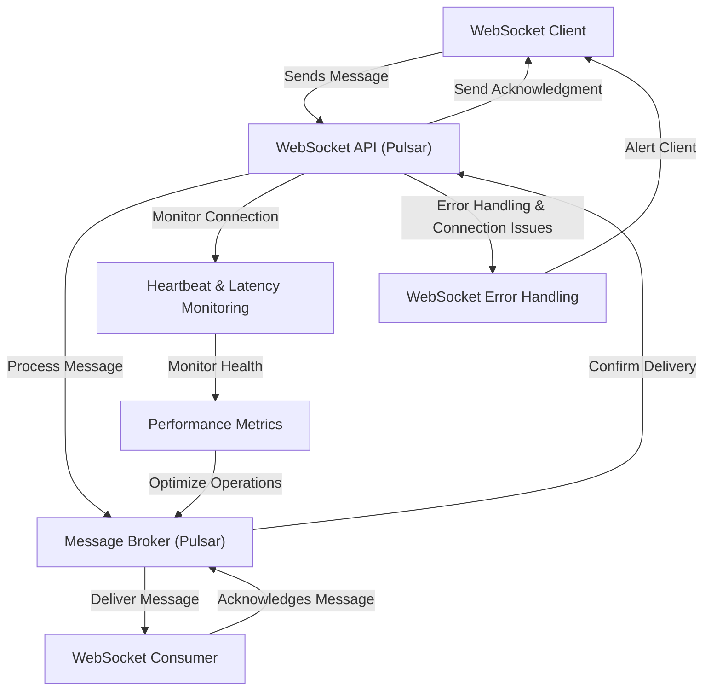
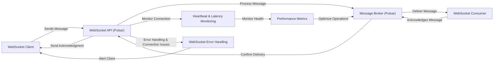
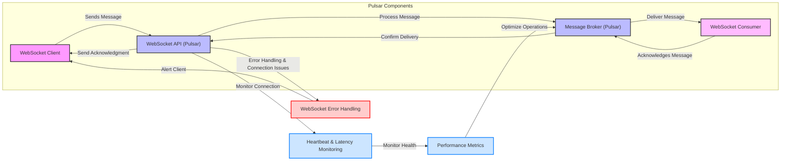
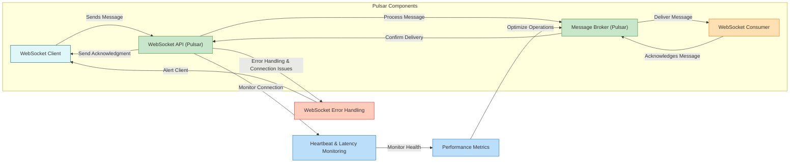

# simple_pulsar_example
This is a simple pulsar example that I have put together using a bunch of LLMs







```mermaid
graph LR;
    %% Define Styles
    classDef clientStyle fill:#ffcc00,stroke:#000000,stroke-width:2px;
    classDef apiStyle fill:#66ccff,stroke:#000000,stroke-width:2px;
    classDef brokerStyle fill:#99ff99,stroke:#000000,stroke-width:2px;
    classDef consumerStyle fill:#ff9966,stroke:#000000,stroke-width:2px;
    classDef monitorStyle fill:#cccccc,stroke:#000000,stroke-width:2px;
    classDef errorStyle fill:#ff6666,stroke:#000000,stroke-width:2px;

    %% Nodes
    A[WebSocket Client]:::clientStyle -->|Sends Message| B[WebSocket API (Pulsar)]:::apiStyle;
    B -->|Process Message| C[Message Broker (Pulsar)]:::brokerStyle;
    C -->|Deliver Message| D[WebSocket Consumer]:::consumerStyle;
    D -->|Acknowledges Message| C;
    C -->|Confirm Delivery| B;
    B -->|Send Acknowledgment| A;
    
    %% Monitoring and Error Handling
    B -->|Monitor Connection| E[Heartbeat & Latency Monitoring]:::monitorStyle;
    E -->|Monitor Health| F[Performance Metrics]:::monitorStyle;
    F -->|Optimize Operations| C;
    B -->|Error Handling & Connection Issues| G[WebSocket Error Handling]:::errorStyle;
    G -->|Alert Client| A;

    %% Styling Definitions for Flow Lines
    class A,B,C,D,E,F,G clientStyle,apiStyle,brokerStyle,consumerStyle,monitorStyle,errorStyle;
```
