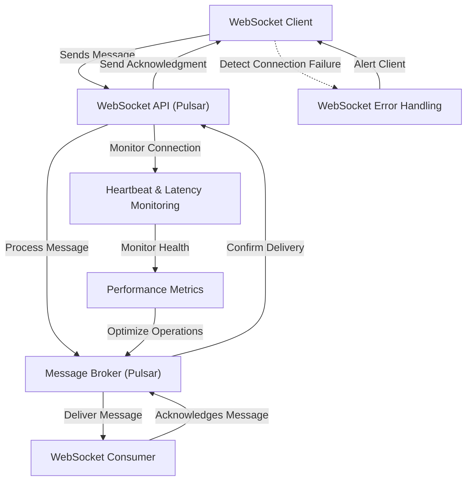

# simple_pulsar_example
This is a simple pulsar example that I have put together using a bunch of LLMs


```mermaid
graph TD;
    A[WebSocket Client] -->|Sends Message| B[WebSocket API (Pulsar)];
    B -->|Process Message| C[Message Broker (Pulsar)];
    C -->|Deliver Message| D[WebSocket Consumer];
    D -->|Acknowledges Message| C;
    C -->|Confirm Delivery| B;
    B -->|Send Acknowledgment| A;
    B -->|Monitor Connection| E[Heartbeat & Latency Monitoring];
    E -->|Monitor Health| F[Performance Metrics];
    F -->|Optimize Operations| C;
    B -->|Error Handling & Connection Issues| G[WebSocket Error Handling];
    G -->|Alert Client| A;
```

