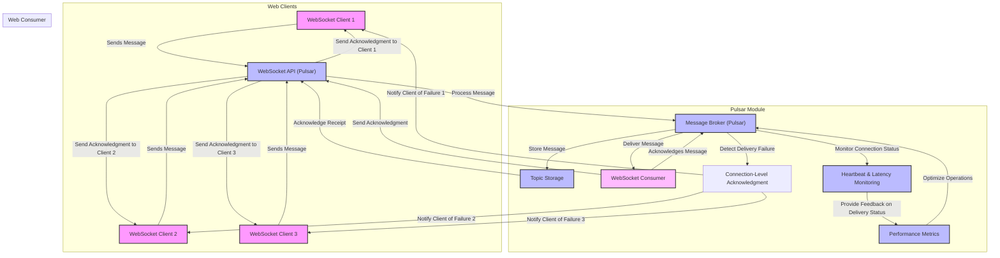

# simple_pulsar_example
This is a simple pulsar example that I have put together using a bunch of LLMs

```mermaid
graph TD;
    %% Define colors
    classDef client fill:#f9f,stroke:#333,stroke-width:2px;
    classDef pulsar fill:#bbf,stroke:#333,stroke-width:2px;
    classDef consumer fill:#fbf,stroke:#333,stroke-width:2px;

    subgraph Web_Client [Web Clients]
        direction TB
        A1[WebSocket Client 1]:::client -->|Sends Message| B["WebSocket API (Pulsar)"]:::pulsar;
        A2[WebSocket Client 2]:::client -->|Sends Message| B;
        A3[WebSocket Client 3]:::client -->|Sends Message| B;
    end

    subgraph Pulsar_Module [Pulsar Module]
        direction TB
        B -->|Process Message| C["Message Broker (Pulsar)"]:::pulsar;
        C -->|Store Message| D[Topic Storage]:::pulsar;
        D -->|Acknowledge Receipt| B;

        C -->|Deliver Message| E[WebSocket Consumer]:::consumer;
        E -->|Acknowledges Message| C;

        E -->|Send Acknowledgment| B;
        B -->|Send Acknowledgment to Client 1| A1;  
        B -->|Send Acknowledgment to Client 2| A2;  
        B -->|Send Acknowledgment to Client 3| A3;  

        %% Connection-Level Acknowledgment
        C -->|Detect Delivery Failure| F[Connection-Level Acknowledgment];
        F -->|Notify Client of Failure 1| A1;  
        F -->|Notify Client of Failure 2| A2;  
        F -->|Notify Client of Failure 3| A3;  

        %% Latency and Monitoring
        G[Heartbeat & Latency Monitoring]:::pulsar;
        C -->|Monitor Connection Status| G;
        G -->|Provide Feedback on Delivery Status| H[Performance Metrics]:::pulsar;
        H -->|Optimize Operations| C;
    end

    subgraph Web_Consumer [Web Consumer]
        direction TB
        E:::consumer;
    end
```
